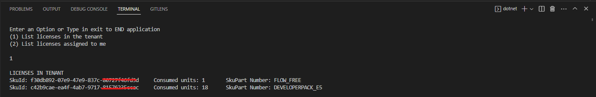

# .NET v7.0 console app connected to Microsoft Graph

This is a console application built using .NET v7.0 that connects to Microsoft Graph.

This console application provides information about licenses that an organization has acquired and licenses that are assigned to the signed user

User is given 2 options
(1) Retrieve a list of commercial subscriptions that an organization has acquired
(2) Retrieve a list of licenses assigned to me

To end application enter exit 

Future improvments:
*Retrieve a list of licenses assigned to a given user (by ID)
*Use filter to get a list of users who are assigned a specific license
*Create a user who is new to organization and assign him license(s) 

[how to register and run the app ](https://github.com/microsoft/hack-together/blob/main/templates/dotnet-console-app-microsoft-graph/README.md)

